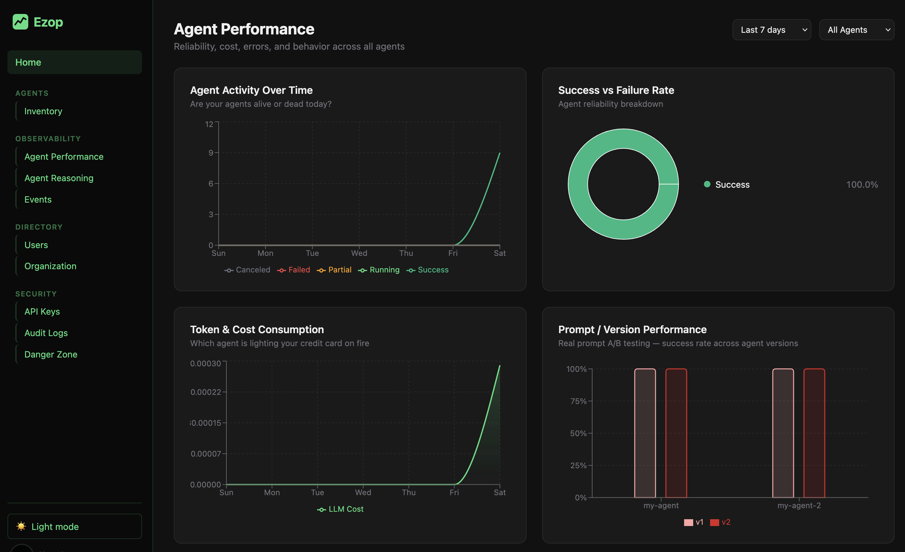

# Ezop

Ezop is a vendor-agnostic open-source observability platform for AI agents. It tracks agent registrations, versions, runs, spans, and events so you have full visibility into every agent deployment.

Ezop isn’t a metrics or logging system—it’s AI-native observability that understands your agents’ intent and where they get stuck.

**What makes Ezop different**

* Intent-aware tracing → not just events, but goals, steps, and outcomes
* Reasoning visibility → inspect agent decisions, tool usage, and paths taken
* Failure understanding → detect stalls, loops, and degraded behavior
* Agent-centric model → built for autonomous systems, not stateless requests

## Historical Æsop

[Aesop](https://en.wikipedia.org/wiki/Aesop) (Ancient Greek: Αἴσωπος, *Aísōpos*; c. 620–564 BCE) was a Greek fabulist and storyteller credited with a collection of tales now known as Aesop's Fables — moral stories featuring anthropomorphic animals that have been retold across cultures for over two millennia. Though no writings by him survive and his very existence is debated, ancient sources including Aristotle, Herodotus, and Plutarch record scattered details of his life. He is traditionally described as a slave who won his freedom through wit and went on to advise kings and city-states. The name *Ezop* is the Turkish rendering of Æsop, and it felt like the right name for a platform built around agents that observe, reason, and tell the story of what happened.

## Screenshots



[Agent Inventory](.github/screenshots/01-Ezop-Inventory.png) · [Events](.github/screenshots/03-Ezop-Events.png) · [Audit Log](.github/screenshots/04-Ezop-AuditLog.png)

## Architecture

```
ezop/
├── ezop-platform/     # REST API server (FastAPI + PostgreSQL)
├── ezop-light-ui/     # Dashboard web app (Next.js)
└── ezop-sdk/
    └── python/        # Python SDK (pip install ezop)
```

```
┌─────────────────┐        ┌───────────────────┐
│   ezop-sdk      │──────▶ │  ezop-platform    │
│  (Python SDK)   │  REST  │  (FastAPI server) │
└─────────────────┘        └────────┬──────────┘
                                    │ PostgreSQL
                           ┌────────▼─────────┐
                           │  ezop-light-ui   │
                           │  (Next.js UI)    │
                           └──────────────────┘
```

- **ezop-platform** — FastAPI REST API. Agents authenticate with an API key and send runs, spans, and events. Enforces plan limits, stores everything in PostgreSQL.
- **ezop-light-ui** — Next.js dashboard. Browse agents, inspect runs, manage API keys, and invite team members.
- **ezop-sdk** — Python client library. `pip install ezop`. Handles registration, versioning, and run tracking.

## Quick Start (Docker Compose)

**Prerequisites:** Google OAuth 2.0 credentials — create a client ID at [Google Cloud Console](https://console.cloud.google.com/) with redirect URI `http://localhost:13001/api/auth/callback/google`.

Create a `.env` file in the repo root:

```bash
AUTH_SECRET=$(openssl rand -base64 32)
GOOGLE_CLIENT_ID=your-google-client-id
GOOGLE_CLIENT_SECRET=your-google-client-secret
```

Start all services:

```bash
docker compose up --build
```

| Service | URL |
|---|---|
| Dashboard (ezop-light-ui) | http://localhost:13001 |
| API server (ezop-platform) | http://localhost:13000 |
| PostgreSQL | localhost:13002 |

```bash
docker compose up -d          # run in background
docker compose logs -f        # tail logs
docker compose down -v        # stop and delete database volume
```

## Projects

### ezop-platform

FastAPI REST API server. Requires Python 3.12+ and PostgreSQL.

| Variable | Default | Description |
|---|---|---|
| `DATABASE_URL` | — | PostgreSQL connection string (required) |
| `EZOP_PORT` | `13000` | Port to listen on |
| `LOG_LEVEL` | `INFO` | Log level |

```bash
cd ezop-platform
python -m venv .venv
.venv/bin/pip install -r requirements.txt
DATABASE_URL=postgresql://... .venv/bin/hypercorn app.main:app --reload
```

### ezop-light-ui

Next.js dashboard. Requires Node 20+ and the same PostgreSQL database.

| Variable | Description |
|---|---|
| `DATABASE_URL` | PostgreSQL connection string (required) |
| `AUTH_SECRET` | NextAuth secret, min 32 chars — generate with `openssl rand -base64 32` (required) |
| `GOOGLE_CLIENT_ID` | Google OAuth 2.0 client ID (required) |
| `GOOGLE_CLIENT_SECRET` | Google OAuth 2.0 client secret (required) |
| `EZOP_API_URL` | URL of ezop-platform (required) |

```bash
cd ezop-light-ui
npm install
npx prisma generate
npx prisma db push
npm run dev
```

Sign in with your Google account, then go to **Settings → API Keys** to create an API key for the SDK.

### ezop-sdk (Python)

```bash
pip install ezop
export EZOP_API_URL=http://localhost:13000
export EZOP_API_KEY=your-api-key
```

```python
from ezop import Agent

agent = Agent.init(name="my-agent", owner="my-team", version="v1.0", runtime="python")

with agent.span("llm.call"):
    response = llm.generate(prompt)

agent.close(status="success")
```

See [ezop-sdk/python/README.md](ezop-sdk/python/README.md) for the full API reference.

## Database

See [ezop-platform/database/README.md](ezop-platform/database/README.md) for schema ownership, migration strategy, and deployment instructions.

## License

Apache 2.0
